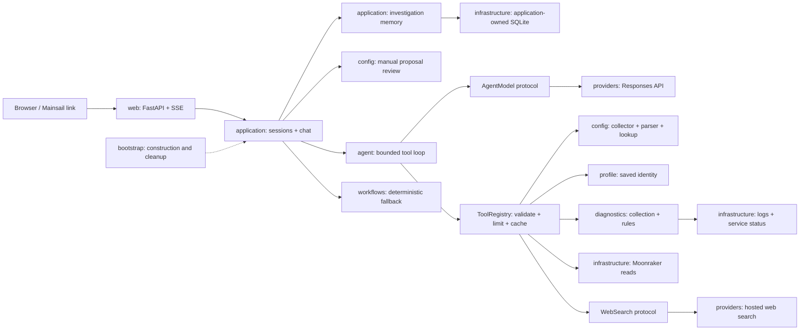

# Architecture

KlipperAI is a standalone async Python daemon on the printer host. Mainsail links
to its same-origin `/klipperai/` UI; Moonraker remains the printer API. The runtime
reads evidence and drafts config proposals. It cannot apply them.

## Runtime and ownership



The [generated dependency graph](generated/dependencies.mmd) shows actual imports
between packages. It is a discovery aid, not the runtime call graph. The generator
rejects cycles between individual modules.

| Package | Owns |
| --- | --- |
| `web` | HTTP validation, HTML/assets, streaming transport |
| `application` | Session validity, investigation memory, routing and proposal review |
| `domain` | Typed evidence, investigations, proposals, messages and repository ports |
| `agent` | Iteration, budgets, tool contracts, request-local evidence and events |
| `providers` | OpenAI protocol, search adapter, single-pass compatibility providers, offline stubs |
| `config` | Includes, parsing, lookup, request targets, proposal strategies |
| `profile` | Saved identity, composed host/hardware/capability/addon detection, INI persistence |
| `diagnostics` | Snapshots and deterministic issue rules |
| `infrastructure` | Moonraker transport and bounded host readers |
| `contracts` | HTTP request/response models and compatibility re-exports |
| `runtime` | Settings and logging |
| `bootstrap` | Composition root and client shutdown |
| `cli` | Profile detection and legacy command-name adapters |
| `workflows` | Offline/config workflow steps and citation helpers |

## Tool-using request flow

```mermaid
sequenceDiagram
    actor User
    participant UI as Browser
    participant API as ChatService
    participant Loop as AgentRunner
    participant Model as AgentModel
    participant Tool as ToolRegistry
    User->>UI: Ask a question
    UI->>API: POST /api/chat/stream
    API->>API: Validate session, load saved investigation and dated memory
    API->>Loop: Request and user-provided artifacts
    loop Until answer or configured budget
        Loop->>Model: Conversation + tool definitions
        Model-->>Loop: Tool calls or final JSON answer
        opt Tool requested
            Loop-->>UI: tool_started event
            Loop->>Tool: Validate and execute read-only operation
            Tool-->>Loop: Observation or recoverable error
            Loop-->>UI: tool_completed / tool_error event
            Note over Loop,Model: Next model call includes actual tool output
        end
    end
    Loop-->>API: Answer, findings, sources, activity, status
    API->>API: Review proposals and persist public evidence/outcome
    API-->>UI: result event
    UI-->>User: Answer + sources + expandable activity
```

OpenAI requests default to `AgentWorkflow`. The model chooses what to inspect and
can revise its next action after observing evidence. There is no preflight LLM
intent classification in this path. The user sees action summaries, never hidden
reasoning. Responses output items, including encrypted reasoning, are passed
unchanged between model turns within one investigation; `store=false` is used.

`stub` uses deterministic workflows without credentials or network LLM calls.
Setting `agent_enabled=false` retains the older single-pass OpenAI path for
troubleshooting. Neither setting enables writes.

## Tools and evidence

| Tool | Boundary and evidence |
| --- | --- |
| `get_printer_profile` | Saved firmware/hardware/addon summary, explicitly not live state |
| `get_printer_status` | Fixed read-only Moonraker methods and known status objects |
| `inspect_config` | File/section index or exact excerpts; optional inactive-file lookup |
| `read_config_file` | Bounded lines from an exact path in the collected tree |
| `collect_diagnostics` | Log tails, optional service/journal reads, deterministic findings |
| `search_web` | Public technical query via hosted search, with source URLs |

Tool caches and fresh config snapshots belong to one request. Successful identical
calls reuse observations within that request; failures can be retried. Public
observations are saved with timestamps and revisions for historical retrieval.
Fresh source cards come from tools and provider annotations, not model-supplied
source objects. Historical context is labeled separately and must be rechecked.

The registry rejects unknown tools and invalid/extra arguments. Per-tool timeouts,
run deadlines, model-step limits, call limits, output-token bounds and context
character limits prevent unbounded loops. Limit/error responses retain collected
findings and source cards and identify incomplete work. Tool errors are observations
the model can recover from. Browser disconnects cancel the run; SSE heartbeats keep
idle proxy connections open.

## State and deployment

The flat layout keeps one importable `klipperai_agent/` package at the repository
root. Hatch includes Python modules, templates and static assets in the wheel.
CLI names remain `klipperai-agent` and `klipperai-detect-profile`; older
`klippyai-*` commands adapt environment variables into the canonical package.

Sessions are ephemeral. `thread_id` identifies a durable investigation stored in
`data_dir/investigations.sqlite3`. Server history takes precedence over browser
history for existing investigations. Relevant historical evidence can be supplied
to a new chat; current config/status still require fresh reads. Provider HTTP
clients are pooled and closed with the application lifespan.

Proposals undergo static review and section comparison. Users edit config files
manually; there are no apply/approval endpoints or write tools. Revalidation reads
the active config and marks changed revisions stale. See
[investigations.md](investigations.md) for lifecycle, storage limits and endpoints.

The supported host is Python 3.10+, FastAPI, Pydantic v1 and httpx. The new loop
does not require LangGraph, an agents framework, a search SDK or Rust extensions.
API keys stay in the server environment. The app assumes the existing trusted
local deployment/proxy boundary; account authentication remains backlog work. Hosted search requires a compatible OpenAI model and uses provider credits.

Protocol references: [function calling](https://developers.openai.com/api/docs/guides/function-calling),
[web search](https://developers.openai.com/api/docs/guides/tools-web-search), and
[Responses API](https://developers.openai.com/api/reference/cli/resources/responses/methods/create).
