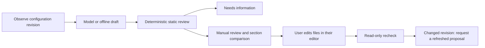

# Investigations, memory, and manual configuration review

An investigation is a persistent conversation about the configured printer. Its
turns contain the user's question, the public result, dated tool observations,
findings, citations and reviewed proposals. Hidden model reasoning and provider
conversation state are never stored.

## Memory behavior

- Reopening a chat loads server-side history. The browser's history is accepted
  only when importing a conversation that has no server record yet.
- New chats have separate dialogue histories. By default, they receive up to six
  relevant historical observations from recent investigations on this printer.
  Selection uses word overlap; it is bounded retrieval, not an embedding index.
- Historical observations carry their collection timestamp and config revision.
  The UI labels supplied historical context separately from fresh sources.
  Prompts require current config/status/log reads before claims about current state.
- `memory_cross_chat: false` isolates evidence between chats. Within-chat history
  and evidence still persist. `conversation_history_pairs: 0` disables dialogue
  context, not evidence memory.
- Saved profiles remain explicitly saved identity; their observation time does not
  mean hardware was rediscovered then. Prior model conclusions are dialogue, not
  independently verified evidence.
- Deleting a chat removes its server record and observations from future retrieval.
  Statements already quoted in another conversation remain part of that dialogue.

Storage is `data_dir/investigations.sqlite3`. The configured data directory must
stay outside printer config, G-code and log directories. Database/auxiliary-file
symlinks and hardlinks are rejected; the database receives owner-only permissions
where supported. Filesystem access happens in worker threads with a connection per
operation, foreign keys, atomic commits and optimistic revision checks. A concurrent
update returns a conflict rather than silently losing a turn.

Records expire after `memory_retention_days` (default 90), with at most 1,000 turns
retained globally. Pruning occurs on writes; expired investigations are excluded
from reads. At most 50 recent turns are restored per investigation, and the sidebar
restores the 30 most recently active investigations. The existing deployment is a
shared, trusted printer UI, not a multi-user account system. Changing the configured
Moonraker URL, printer root or root-config setting changes the printer memory scope.

Completed, limited and handled-error results survive service restarts. An interrupted
in-flight model call is not automatically resumed, and its partial tool outputs are
not checkpointed. Sessions remain ephemeral and are renewed by the browser.

## Manual proposal lifecycle

There is no apply, approve, restart or printer-control operation. KlipperAI writes
only its own runtime records/logs. Its profile CLI manages KlipperAI's own settings;
printer configuration proposals always require manual editing.

`ProposalReviewer` checks relative `.cfg` target paths, duplicate sections,
cross-file section conflicts, placeholders, malformed section headers, missing
config evidence and truncated target excerpts. Unresolved includes and incomplete
collection are flagged. A section comparison preserves the distinction between a
snippet and a complete file replacement. SHA-256 revisions include full collected
file content, even when the prompt excerpt was clipped.

Every result remains `manual_only`. `manual_review` means the implemented static
checks found no blocking issue; it does not establish valid firmware options, safe
wiring, or physical safety. `needs_information` carries blocking issues. `stale`
means the observed active config revision changed since the draft's evidence.
Rechecking cannot make an old proposal current again; request a refreshed draft.
No firmware validation commands, restarts or writes are performed.

## Interfaces and ownership

- `domain/`: evidence, proposals, investigations, messages and repository contracts;
  no dependency on HTTP, providers or infrastructure.
- `application/investigations.py`: server history, relevance selection and retention-facing access.
- `infrastructure/investigations.py`: the SQLite repository; only application storage writes.
- `agent/ports.py`: narrow read-only capabilities; tool code does not receive a provider API.
- `agent/runner.py`: typed `InvestigationRequest` and `InvestigationResult`.
- `application/proposal_review.py`: shared review after agent or compatibility workflow output.
- `web/investigations.py`: list/get/delete records and revalidate stored proposals.

The compatibility workflow adapter still accepts dictionaries. Domain models are
re-exported by `contracts/api.py` for existing imports, but domain code owns them.

All investigation endpoints require a valid UI session:

| Method | Path | Result |
| --- | --- | --- |
| GET | `/api/investigations?session_id=...` | Recent investigation summaries |
| GET | `/api/investigations/{id}?session_id=...` | Saved conversation and public evidence |
| DELETE | `/api/investigations/{id}?session_id=...` | Forget application-owned records |
| POST | `/api/investigations/{id}/proposals/{proposal_id}/revalidate?session_id=...` | Read-only review recorded as a new turn |

Tests: `test_investigations.py`, `test_proposal_review.py`, `test_agent.py`, and
`agent-ui.test.mjs`. They cover persistence, historical context, concurrent updates,
deletion, revision changes, path protection and unchanged printer-config bytes.
These tests do not evaluate a live model's diagnostic quality.
